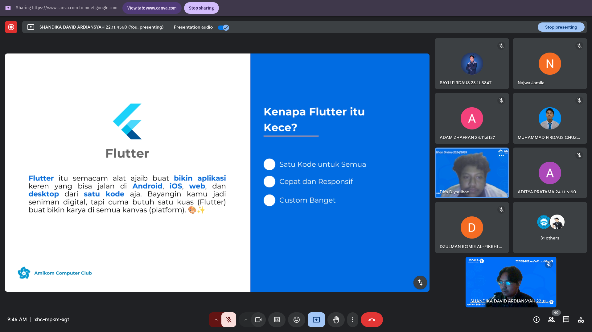
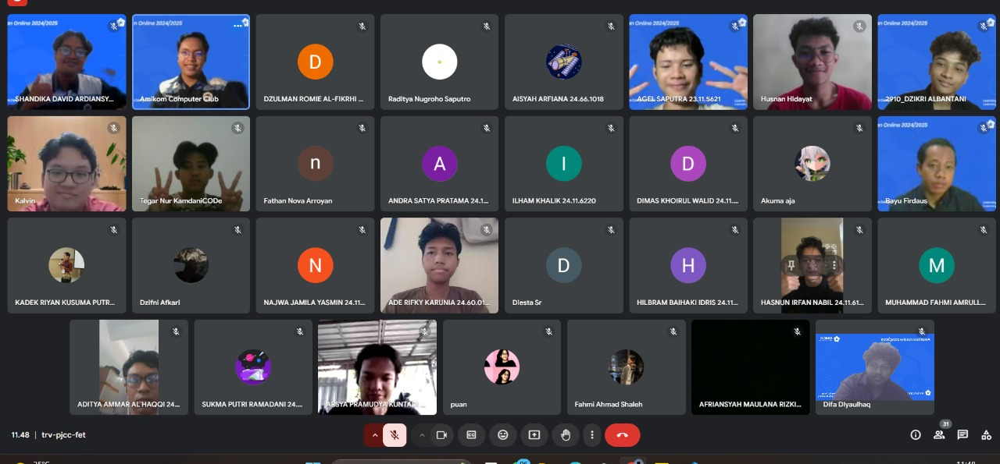

# Introduction to Mobile Programming: Dunia Aplikasi di Genggamanmu

  

Halo Sobat AMCC 💙

Kemarin kita udah bahas secara mendalam apa itu Mobile Programming serta praktikum instalasinya. Sebelum ngoding, disini kita akan mempelajari sesuatu yang penting dan gak kalah keren yaitu Git & Github.

Git dan GitHub adalah dua alat penting untuk para developer, terutama saat bekerja secara tim atau mengelola versi kode. Yuk, kita kenalan lebih dekat dengan dua teman baik ini! 🤝

eits, sebelum itu. Kamu bisa baca modul pelatihan [disini.](https://medium.com/amcc-amikom/introduction-git-github-sahabat-developer-untuk-kolaborasi-dan-versi-kode-ce24a1672464)

##  🚀 Galeri Pelatihan 2 Mobile AMCC 2024/2025

  
  ---
  

Dibuat dengan ❤️ oleh **MOBILE PROGRAMMING AMCC 2024/2025**