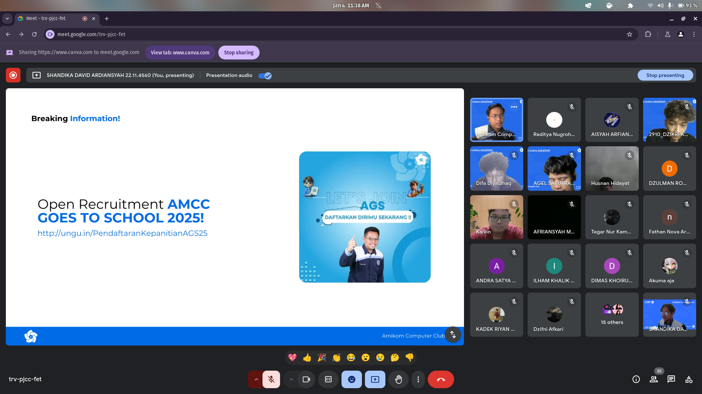

# Introduction to Mobile Programming: Dunia Aplikasi di Genggamanmu

  

Halo sobat AMCC 💙 Senang sekali nih bisa ketemu sama teman-teman semuanya di pelatihan 1 AMCC divisi Mobile programming ini. Pada modul kali ini, kita akan mengenal dunia mobile programming.

Mobile programming itu bisa kita ibaratkan seni dan ilmu membuat aplikasi untuk perangkat yang ada di kantong kita: smartphone dan tablet. Dengan mobile programming, kamu bisa menciptakan aplikasi yang memudahkan hidup, menghibur, atau bahkan mengubah cara orang berinteraksi dengan teknologi. Tapi, apa sih sebenarnya mobile programming itu?

eits, sebelum itu. Kamu bisa baca modul pelatihan [disini](https://medium.com/amcc-amikom/introduction-to-mobile-programming-dunia-aplikasi-di-genggamanmu-52401f146543) serta rekaman pelatihan [disini.](https://drive.google.com/file/d/1YKNg-vFRa_HkG8XVzv-ie0qzF9gB-ntC/view)

##  🚀 Galeri Pelatihan 1 Mobile AMCC 2024/2025

  
  ---
  

Dibuat dengan ❤️ oleh **MOBILE PROGRAMMING AMCC 2024/2025**